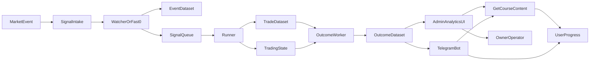

# Product Design Layer

## Purpose

`pump_short` should operate as a product system, not only as a trading engine. The product layer connects:

- trading execution and outcome truth,
- educational delivery through GetCourse and Telegram,
- internal analytics and operator decisions.

Current system anchors:

- Trading intake and strategy runtime: `short_pump/server.py`, `short_pump/watcher.py`, `short_pump/fast0_sampler.py`
- Trade execution and state: `trading/runner.py`, `trading/state.py`, `trading/broker.py`
- Outcome resolution and delivery: `trading/outcome_worker.py`, `trading/paper_outcome.py`, `trading/outcome_delivery.py`
- Reporting and Telegram: `scripts/daily_tg_report.py`, `analytics/executive_report.py`, `telegram/report_bot.py`, `short_pump/telegram.py`

## Product Principles

- Trading-first: real market events and outcomes are the source of truth.
- Explainable system: every signal shown to a user must be explainable in plain language.
- One taxonomy: strategy names and states must match across datasets, Telegram, course content, and analytics UI.
- Operator clarity first: internal UI should expose state, edge, failures, and confidence before it becomes customer-facing.
- Education from real cases: lessons should be built on actual events, trades, outcomes, and post-mortems.

## Shared Product Model

## Personas

### 1. Newbie

- Goal: understand what the system does and learn how entries and exits work.
- Fear: losing money because signals feel like a black box.
- Need: plain-language explanations, guided onboarding, low cognitive load.
- Primary success: completes onboarding, follows a lesson path, starts reading signals correctly.

### 2. Trader

- Goal: evaluate whether strategies are trustworthy and actionable.
- Fear: fake edge, delayed outcomes, or hidden degradation.
- Need: metrics, historical evidence, strategy states, risk context, and fast access to details.
- Primary success: uses signals and reports confidently, understands when not to act.

### 3. Observer

- Goal: watch the system passively and decide whether to engage deeper.
- Fear: spam, complexity, and unclear value.
- Need: summaries, social proof, weekly recaps, and lightweight education.
- Primary success: returns regularly and converts into learner or trader follower.

## CJM

### Journey Stages

- Acquisition
- Activation
- Onboarding
- Value discovery
- Habit loop
- Conversion
- Retention

### Newbie CJM

| Stage | User question | Product touchpoint | System response | Success metric |
|---|---|---|---|---|
| Acquisition | "What is this?" | Telegram invite, content teaser, referral | Bot explains system in 3 lines and offers persona choice | Start rate |
| Activation | "Where do I begin?" | Telegram bot | Bot asks role and routes to newbie onboarding | Role classification rate |
| Onboarding | "How does a signal become a trade?" | GetCourse module 0-2 + bot prompts | Shows watcher -> entry -> outcome flow with real examples | Onboarding completion |
| Value discovery | "Can I trust this?" | Telegram signal cards + recap | Shows strategy, context score, reasons, and later result | First signal open rate |
| Habit loop | "What should I check daily?" | Daily recap in bot | Sends one lesson, one case, one system stat | 7-day retention |
| Conversion | "Am I ready for the next level?" | Course checkpoint | Unlocks advanced modules or trader mode | Upgrade to trader track |
| Retention | "Am I progressing?" | Progress screen | Shows lessons done, quiz score, badges, streak | WAU, lesson streak |

### Trader CJM

| Stage | User question | Product touchpoint | System response | Success metric |
|---|---|---|---|---|
| Acquisition | "Does this edge exist?" | Report sample, signal preview | Shows recent WR, EV, EV20, strategy status | Report click-through |
| Activation | "What exactly am I following?" | Bot role selection | Routes to trader mode with strategy preferences | Trader profile completion |
| Onboarding | "What is tradable now?" | Bot setup + strategy explainer | Sets strategy subscriptions and alert thresholds | Alert setup completion |
| Value discovery | "Why this entry?" | Telegram entry card | Shows strategy, context, dist, liq, TP, SL, risk profile | Entry explanation open rate |
| Habit loop | "What changed today?" | Daily and weekly reports | Sends compact report, strategy health, incidents | Active report readers |
| Conversion | "Should I trust live mode?" | Strategy detail and cohort evidence | Shows maturity, guard state, reliability, and case history | Premium conversion |
| Retention | "Is the system improving?" | Bot + analytics summaries | Sends performance drift, new lessons, and incidents | Paid retention |

### Observer CJM

| Stage | User question | Product touchpoint | System response | Success metric |
|---|---|---|---|---|
| Acquisition | "Why should I care?" | Social proof and recap card | Shows concise outcomes and edge summary | Subscribe rate |
| Activation | "Can I just watch?" | Telegram bot | Routes to observer mode without setup burden | Observer mode activation |
| Onboarding | "What do these labels mean?" | Mini glossary in bot | Explains TP, SL, TIMEOUT, ACTIVE, WATCH, DISABLED | Glossary completion |
| Value discovery | "Is this real?" | Weekly evidence digest | Shows real routed signals and outcomes, not synthetic smoke | Digest open rate |
| Habit loop | "Do I want more detail?" | Weekly digest + badges | Nudges to beginner lessons or strategy deep dives | Observer to learner conversion |
| Conversion | "What is the next step?" | Role upgrade prompt | Offers newbie or trader path | Path upgrade rate |
| Retention | "What happened this week?" | Weekly summary | Sends highlights, misses, and system changes | Weekly return rate |

## 1. Educational Product Design

### User Journey

- User enters through Telegram.
- Bot detects persona and level.
- User is routed into a GetCourse track with Telegram as the daily habit layer.
- User consumes short modules tied to actual strategy events.
- User receives checkpoints, quizzes, and evidence-based recaps.
- User graduates into advanced analysis or trading-follow mode.

### Onboarding Flow

1. Welcome screen in Telegram: "What do you want from the system?"
2. Persona selection: `newbie`, `trader`, `observer`.
3. Level check: experience, market familiarity, objective.
4. Strategy interest selection: `short_pump`, `fast0`, `filtered`.
5. Consent to receive alerts, lesson nudges, and weekly recaps.
6. Route to the first lesson and first report card.

### Course Structure

#### Module 0. System Map

- What `pump_short` is.
- How market events become signals, trades, and outcomes.
- Difference between watcher, runner, outcome, and risk guard.

#### Module 1. Signal Literacy

- What a pump means.
- How `stage`, `dist_to_peak_pct`, `context_score`, and `liq_long_usd_30s` affect decisions.
- Difference between `short_pump`, `fast0`, and filtered routes.

#### Module 2. Entry Logic

- Why an entry appears.
- What TP / SL / TIMEOUT mean.
- When a setup is blocked or downgraded.

#### Module 3. Outcome Literacy

- How outcomes are resolved in paper and live.
- Why operational metrics matter in addition to PnL.
- How to read case replays and post-trade explanations.

#### Module 4. Risk and Guard

- ACTIVE / WATCH / DISABLED / RECOVERY states.
- Why a strategy can be statistically good but operationally unsafe.
- How risk guard protects against degraded edge.

#### Module 5. Strategy Tracks

- `short_pump`: slower structural setup.
- `fast0`: early fast-window logic.
- Filtered strategies: what is excluded and why.

#### Module 6. Review and Progression

- Case-based quiz.
- "Read a signal" exercise.
- Recommendation for next path: observer, learner, trader, advanced.

### What Data to Show Learners

- Strategy name and one-line definition.
- Signal timestamp, symbol, and market context.
- Entry reason in plain language.
- Entry, TP, SL, exit, and outcome.
- Outcome explanation: exchange-close, klines, or timeout.
- Risk state at the time of entry.
- Recent strategy health: WR, EV, EV20, timeout share.

### Educational Triggers

- New user joined.
- Onboarding incomplete for 24 hours.
- First signal received.
- First correct quiz answer.
- First week completed.
- Strategy changed state, for example ACTIVE -> WATCH.
- Real case available that matches the user's track.

## 2. Telegram Learning Bot Design

### Bot Modes by Persona

#### Newbie Mode

- Daily lesson card.
- Simplified signal explanations.
- Glossary shortcuts.
- Quiz and progress tracking.

#### Trader Mode

- Live or paper signal cards.
- Strategy health summaries.
- Outcome follow-ups.
- Risk guard and degradation alerts.

#### Observer Mode

- Weekly digest.
- Minimal daily noise.
- Milestone and proof-based updates.
- Upgrade prompts into learning or trader mode.

### Core Bot Scenarios

1. `/start`
2. Role selection
3. Strategy subscription setup
4. Daily lesson delivery
5. Signal explanation card
6. Outcome follow-up card
7. Weekly system recap
8. Badge or level unlock
9. Upgrade path suggestion
10. Incident notification when a strategy is degraded or paused

### What the Bot Shows

#### Signal Card

- Strategy
- Symbol
- Entry direction
- Why the setup qualified
- Key features such as `stage`, `dist`, `liq`, `context_score`
- Risk profile
- Suggested lesson link if relevant

#### Statistics Card

- Last 7d and 30d outcomes
- WR
- EV
- EV20
- Timeout share
- Guard state
- Sample size maturity

#### Entry Explanation Card

- Setup type
- Reason the route was accepted
- Reason the baseline or filtered branch was chosen
- What could invalidate the setup
- Link to the matching lesson

### Gamification

- Levels: `observer`, `learner`, `analyst`, `trader`.
- Badges: `first_week`, `signal_reader`, `risk_guard_understood`, `fast0_explorer`, `short_pump_mapper`.
- Streaks: daily lesson streak, weekly recap streak.
- Milestones: first completed module, first 5 explained signals, first passed quiz set.
- Confidence meter: how much of the system the user has already learned.

### Telegram IA and Commands

- `/start`
- `/profile`
- `/progress`
- `/signals`
- `/stats`
- `/lesson`
- `/explain`
- `/weekly`
- `/glossary`
- `/settings`

## 3. Analytics System Design

### Admin UI Goal

The admin UI is the owner's operating console. It must show:

- what the system is doing right now,
- whether strategy edge is healthy,
- where pipeline failures are forming,
- what can be promoted into learning content and customer surfaces.

### Main Overview Screen

#### Top summary

- System state: ACTIVE, WATCH, DISABLED counts
- Routed signals today
- Trades opened today
- Outcomes resolved today
- Outcome resolution lag
- Alerts and incidents

#### Strategy strip

- `short_pump`
- `short_pump_filtered`
- `short_pump_fast0`
- `short_pump_fast0_filtered`

Each card shows:

- current guard state,
- 7d and 30d EV,
- WR,
- recent sample size,
- timeout rate,
- last incident,
- recommendation: keep, observe, pause, promote.

#### Reliability strip

- watcher uptime
- queue backlog
- runner latency
- pending live outcomes
- duplicate outcomes
- data quality warnings

### Module Screens

#### Watcher Module

Show:

- incoming market events,
- accepted versus rejected watches,
- active symbols,
- average watch duration,
- stage progression,
- reasons for non-materialization,
- symbol-level error log.

Charts:

- events over time,
- stage distribution,
- dist-to-peak distribution,
- watcher drop-off funnel.

Errors:

- API fetch issues,
- stalled watches,
- duplicate watch attempts,
- missing feature coverage.

#### Runner Module

Show:

- queue depth,
- consumed signals,
- paper and live opens,
- open failure reasons,
- broker latency,
- rejected by risk profile,
- rejected by guard.

Charts:

- queue age,
- open success rate,
- time from event to open,
- paper versus live split.

Errors:

- broker errors,
- state write failures,
- missing mapping keys,
- insufficient balance or risk violation.

#### Outcome Module

Show:

- pending outcomes,
- resolved outcomes,
- resolution source: exchange, klines, timeout,
- outcome lag,
- unresolved aging buckets,
- TP / SL / TIMEOUT mix.

Charts:

- resolution source trend,
- outcome lag histogram,
- timeout trend by strategy,
- duplicate or replay fixes over time.

Errors:

- exchange reconciliation misses,
- retCode failures,
- zero-mfe / zero-mae anomalies,
- state desync warnings.

#### Risk Guard Module

Show:

- current state per strategy and submode,
- last transition,
- blocked signals or trades,
- recovery progress,
- false block review queue.

Charts:

- guard transitions over time,
- blocked versus allowed trades,
- EV20 versus state transitions.

Errors:

- stale guard update,
- missing rolling window,
- inconsistent strategy key mapping.

#### Experiments / ML Module

Show:

- experiment roster,
- feature coverage,
- train set size,
- label quality,
- backtest versus production drift,
- promotion readiness.

Charts:

- sample growth,
- factor lift,
- model readiness by strategy,
- feature null-rate trends.

Errors:

- training job failures,
- schema drift,
- missing labels,
- low-sample experiments.

#### Strategy Detail Screen

One page per strategy:

- definition,
- filter logic,
- lifecycle funnel: event -> trade -> outcome,
- WR / EV / EV20,
- timeout rate,
- guard state timeline,
- recent incidents,
- recent case studies,
- linked lessons and Telegram content using this strategy.

## UI Screen List

### Internal Operator Screens

1. Login and workspace selector
2. Overview dashboard
3. Alerts and incidents timeline
4. Watcher module
5. Runner module
6. Outcome module
7. Risk guard module
8. Experiments / ML module
9. Strategy detail: `short_pump`
10. Strategy detail: `short_pump_filtered`
11. Strategy detail: `short_pump_fast0`
12. Strategy detail: `short_pump_fast0_filtered`
13. Dataset quality and lineage monitor
14. Telegram content queue
15. Course content map
16. User cohorts and progress
17. Weekly review and release gate

### User-Facing Future Screens

1. Learner dashboard
2. Strategy explorer
3. Signal archive with explanations
4. Progress and badge wallet
5. Weekly evidence recap

## Screen-Level Data Requirements

### Overview Dashboard

- Guard state counts
- Routed signals today
- Trades today by mode
- Outcomes today by source
- Pending outcome backlog
- Top incidents
- Strategy health summary

### Dataset Quality and Lineage Screen

- Event count
- Trade count
- Outcome count
- Join rate `event_id -> trade_id -> outcome`
- Missing outcomes
- Duplicate lineage count
- Schema warnings
- Partition freshness

### Telegram Content Queue Screen

- Latest signal cards produced
- Outcome cards waiting for delivery
- Educational messages scheduled
- Delivery failures
- Persona-targeted content performance

### Course Content Map Screen

- Modules
- Linked real cases
- Completion rate
- Quiz pass rate
- Content freshness
- Unlinked lessons that need case material

## Owner Metrics

### Trading Health

| Metric | Formula | Source of truth |
|---|---|---|
| Routed signals | count of accepted signal rows | `events_v3.csv` |
| Trade open rate | trades / routed signals | `trades_v3.csv`, `events_v3.csv` |
| Outcome resolution rate | resolved outcomes / trades | `outcomes_v3.csv`, `trading_closes.csv` |
| Timeout share | TIMEOUT / resolved outcomes | `outcomes_v3.csv`, `trading_closes.csv` |
| Strategy maturity | core outcomes in window | analytics layer |

### Edge Quality

| Metric | Formula | Source of truth |
|---|---|---|
| WR | TP / (TP + SL) | analytics report logic |
| EV | mean core pnl in R | analytics report logic |
| EV20 | rolling EV over last 20 core trades | `analytics/executive_report.py` |
| MDD | min drawdown over pnl series | analytics report logic |
| Drift | EV20 - long-window EV | analytics aggregate layer |

### Reliability

| Metric | Formula | Source of truth |
|---|---|---|
| Watcher uptime | healthy heartbeat time / total time | service logs and heartbeats |
| Queue backlog | pending signals count | queue files and runner state |
| Runner latency | open_ts - signal_ts | event and trade timestamps |
| Outcome lag | outcome_ts - close_detectable_ts | outcome logs and exchange reconciliation |
| Duplicate outcome rate | duplicate outcomes / total outcomes | dataset quality monitor |

### Risk

| Metric | Formula | Source of truth |
|---|---|---|
| Guard activation count | number of WATCH or DISABLED transitions | guard state history |
| Blocked trade share | blocked trades / total trade attempts | runner and risk logs |
| Recovery speed | time from DISABLED to ACTIVE | guard history |
| False block review rate | reviewed false blocks / blocked trades | operator review workflow |

### Learning and Product

| Metric | Formula | Source of truth |
|---|---|---|
| Onboarding completion | completed onboarding / started onboarding | bot and course events |
| Lesson completion | completed lessons / started lessons | GetCourse events |
| Quiz pass rate | passed quizzes / attempts | GetCourse events |
| Weekly active learners | active learners in 7d | bot and course events |
| Observer to learner conversion | learners / observers | CRM or bot profile state |
| Learner to trader conversion | traders / learners | subscription state |

## Data Contracts Between Trading, Learning, and Analytics

### Canonical Entities

- `User`
- `Persona`
- `Subscription`
- `Lesson`
- `QuizAttempt`
- `SignalEvent`
- `Trade`
- `Outcome`
- `Alert`
- `Badge`
- `StrategyState`

### Canonical Keys

- `strategy`
- `symbol`
- `run_id`
- `event_id`
- `trade_id`
- `position_id`
- `mode`
- `risk_profile`
- `outcome_source`

### Linking Rules

- A lesson can reference one or more real `event_id` or `trade_id` examples.
- A Telegram explanation card should be linked to the same `event_id` lineage as the trading dataset.
- A strategy page should aggregate all rows where `strategy` matches the canonical taxonomy.
- A weekly recap should blend product metrics and trading truth, but never rewrite raw trading facts.

## How Trading, Learning, and Analytics Connect

### Operational Flow

1. Market event enters `server.py`.
2. Strategy logic in watcher or fast0 produces an event and signal.
3. Runner opens a paper or live trade and records state.
4. Outcome layer resolves the result and stores canonical outcomes.
5. Analytics turns these rows into quality, edge, and reliability metrics.
6. Telegram consumes both event-level and report-level surfaces.
7. GetCourse consumes selected real cases, explanations, and milestones.

### Content Flow

1. Strategy event occurs.
2. System labels the event by strategy, setup, and risk profile.
3. Product layer chooses whether the event becomes:
   - a live alert,
   - an educational case,
   - a weekly recap item,
   - an internal incident review.
4. Analytics scores whether the case is healthy, degraded, or educationally useful.
5. Telegram and course content reuse the same canonical case.

### PM Decision Flow

1. Owner checks overview screen.
2. If strategy health is degraded, owner opens module and strategy pages.
3. If degradation is operational, owner checks watcher, runner, or outcome reliability.
4. If degradation is statistical, owner checks guard and experiments.
5. If the strategy is healthy, owner promotes the best real cases into Telegram education and course modules.

## Product Requirements by Direction

### A. Educational Product

- Must start in Telegram and continue in GetCourse.
- Must show real cases from the trading engine.
- Must separate beginner explanation from advanced analytics.
- Must teach both signal literacy and system literacy.

### B. Telegram Learning Bot

- Must support persona-based delivery.
- Must show both signal and explanation layers.
- Must preserve low-noise observer mode.
- Must support progress, badges, and weekly recaps.

### C. Analytics Admin UI

- Must be module-based.
- Must expose metrics, status, charts, and errors in every module.
- Must treat filtered strategies as first-class, not collapsed into baselines.
- Must support internal operations first and customer surfaces later.

## Phased Rollout

### Phase 1. Internal PM Layer

- Publish this product design.
- Align metric names and strategy taxonomy.
- Define screen specs and event dictionary.

### Phase 2. Delivery Surfaces

- Add persona state and progress tracking to Telegram.
- Add course map and lesson linkage to real cases.
- Add operator dashboard shell around existing report logic.

### Phase 3. Closed-Loop Product

- Feed analytics-selected cases into education automatically.
- Show user progress and cohort outcomes in admin UI.
- Prepare limited customer-facing evidence screens.

## Final Answer to the Product Question

### 1. CJM

- Defined for `newbie`, `trader`, and `observer` with acquisition, onboarding, value discovery, conversion, and retention loops.

### 2. Product Architecture

- One shared system with trading as truth, Telegram as delivery, GetCourse as learning depth, and analytics as operator control.

### 3. UI Screens

- Overview, module pages, strategy pages, lineage monitor, Telegram content queue, course map, cohorts, incidents, and review gate.

### 4. Owner Metrics

- Trading health, edge quality, reliability, risk, learning, and conversion metrics with formulas and source-of-truth datasets.

### 5. How to Link Trading, Learning, and Analytics

- Reuse canonical strategy and lineage keys.
- Turn real signals and outcomes into explainers, lessons, and recaps.
- Let analytics decide which cases are healthy enough for promotion and which require operator action.
